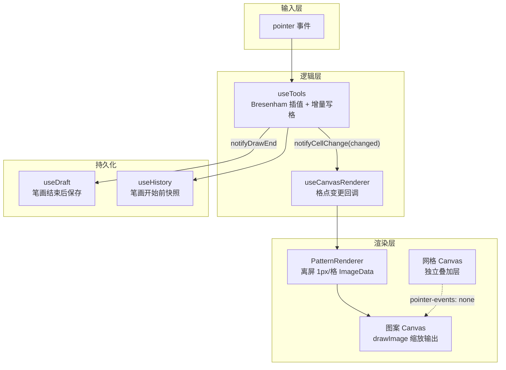
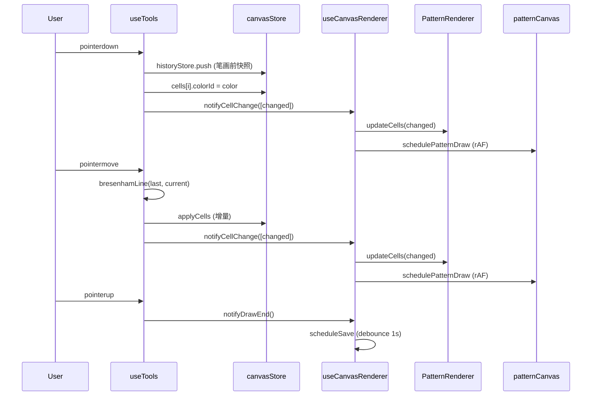
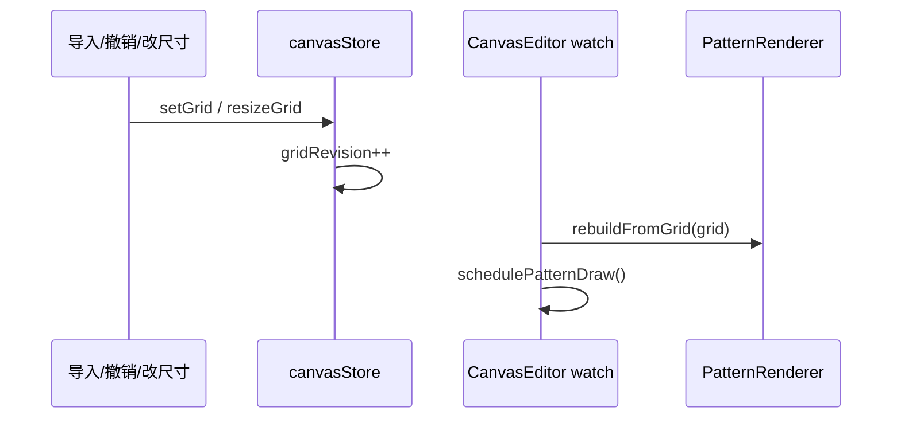

# 画布渲染性能优化技术文档

> 版本：v1.0 | 日期：2026-07-01 | 关联模块：Canvas 编辑器、笔刷工具、图片导入 Worker

---

## 1. 背景与目标

拼豆图纸编辑器的核心交互是**高频笔刷绘制**（`pointermove` 每秒触发数十至上百次）。初版实现中，用户反馈笔刷操作存在明显卡顿，不满足 PRD 中「操作延迟 ≤ 100ms」的非功能需求。

本文档记录性能问题的根因分析、优化方案设计及最终实现，供后续维护与扩展参考。

### 1.1 优化目标

| 指标 | 目标 |
|-----|------|
| 笔刷绘制帧率 | 稳定 60fps（16ms/帧以内） |
| 单帧绘制复杂度 | 与变更格数成正比，而非与总格数成正比 |
| 50×50 网格 | 连续绘制无明显掉帧 |
| 100×100 网格 | 可流畅编辑 |

---

## 2. 问题分析

### 2.1 初版架构（存在性能瓶颈）

```
pointermove
    → 修改 grid.cells[i].colorId        // Pinia 响应式
    → deep watch(grid) 触发              // 监听整个网格
    → scheduleDraw() + watch 回调         // 双重触发
    → 遍历全部 W×H 格                    // 全量重绘
        → 每格 fillRect + strokeRect     // 2×W×H 次 Canvas API 调用
```

### 2.2 瓶颈拆解

| # | 问题 | 影响 |
|---|------|------|
| 1 | **全量重绘** | 50×50 网格每帧 2500 次 `fillRect` + 2500 次 `strokeRect`；100×100 达 20000 次 API 调用 |
| 2 | **deep watch** | `watch(grid, { deep: true })` 在每次格点变更时触发，与 `pointermove` 内联重绘叠加 |
| 3 | **网格与图案耦合** | 笔刷移动时重复绘制网格线，网格线数量 = `(W+1)+(H+1)` 条/帧 |
| 4 | **草稿 deep watch** | `index.vue` 对 `grid` 做深度监听，每个格点变更都重置 LocalStorage 防抖计时器 |
| 5 | **笔画不连续** | 仅更新当前格，快速移动时出现断点，导致重复触发与视觉抖动 |

### 2.3 复杂度对比

| 操作 | 优化前 | 优化后 |
|-----|--------|--------|
| 笔刷移动一帧 | O(W × H) | O(变更格数)，通常 ≤ 笔刷面积 × 线段长度 |
| 网格重绘 | 每帧 | 仅在缩放/平移/开关切换时 |
| 草稿保存 | 每格变更 | 一笔结束后 debounce 1s |

---

## 3. 优化方案总览



核心思路：**读写分离 + 增量渲染 + 分层绘制 + 事件解耦**。

---

## 4. 详细设计

### 4.1 离屏图案缓存 — `PatternRenderer`

**文件**：`lib/canvas/pattern-renderer.ts`

维护一个与网格等大的离屏 Canvas（每格 1 像素），用 `ImageData` 直接操作像素缓冲区：

```
网格坐标 (x, y)  →  ImageData 索引 (y * gridW + x) * 4
色号 ID          →  HEX → RGB（带缓存）
空白格           →  RGB(250, 250, 250)
```

| 方法 | 用途 | 复杂度 |
|-----|------|--------|
| `rebuildFromGrid()` | 导入图片、撤销/重做、改尺寸后全量同步 | O(W × H) |
| `updateCells(cells)` | 笔刷绘制时仅更新变更格 | O(变更数) |
| `drawTo(ctx, ox, oy, cellSize)` | `drawImage` 缩放输出到显示 Canvas | O(1) GPU 加速 |

```typescript
// 增量更新：只写变更像素
updateCells(cells) {
  for (const { x, y, colorId } of cells) {
    this.writePixel(x, y, colorId)
  }
  this.ctx.putImageData(this.imageData, 0, 0)
}

// 显示：一次 drawImage 完成缩放
drawTo(ctx, ox, oy, cellSize) {
  ctx.imageSmoothingEnabled = false  // 保持像素锐利
  ctx.drawImage(this.canvas, ox, oy, gridW * cellSize, gridH * cellSize)
}
```

**色值缓存**：`hexCache: Map<string, [r, g, b]>` 避免重复解析 HEX 字符串。

### 4.2 双层 Canvas 分离

**文件**：`app/components/canvas/CanvasEditor.vue`、`lib/canvas/grid-overlay.ts`

| 层 | 元素 | 内容 | 重绘时机 |
|----|------|------|---------|
| 图案层 | `patternCanvasRef` | 色块 + 选区框 | 格点变更 / 视图变换 |
| 网格层 | `gridCanvasRef` | 网格线 | 缩放、平移、格距变化、开关切换 |

网格层设置 `pointer-events: none`，事件统一由图案层处理，避免重复绑定。

```
┌─────────────────────────────────┐
│  gridCanvas（网格层，透明底）     │  ← 仅画线，pointer-events: none
├─────────────────────────────────┤
│  patternCanvas（图案层）          │  ← 接收所有交互事件
└─────────────────────────────────┘
```

### 4.3 笔刷插值 — Bresenham 直线算法

**文件**：`lib/grid/line-draw.ts`、`app/composables/useTools.ts`

快速移动时 `pointermove` 事件之间可能跨越多个格点。使用 Bresenham 算法在 `lastPos` 与当前 `pos` 之间插值，保证笔画连续：

```
pointermove(pos)
    → bresenhamLine(lastPos, pos)     // 获取线段经过的所有格
    → brushStamp(x, y, brushSize)     // 每个格点扩展笔刷区域
    → applyCells(cells)               // 去重后写入 + 通知渲染
```

`applyCells` 会跳过颜色未变的格（`cell.colorId === colorId`），避免无效更新。

### 4.4 渲染桥接 — `useCanvasRenderer`

**文件**：`app/composables/useCanvasRenderer.ts`

Composable 层与 Canvas 层通过模块级回调解耦，避免循环依赖：

```typescript
// useTools 侧（写入）
notifyCellChange(changedCells)   // 笔刷每帧
notifyDrawEnd()                  // pointerup 时

// CanvasEditor 侧（渲染）
registerCellChange(cells => {
  renderer.updateCells(cells)
  schedulePatternDraw()          // rAF 节流
})
registerDrawEnd(() => scheduleSave())
```

### 4.5 响应式监听策略调整

**移除**对 `grid.cells` 的 `deep watch`，改为两级监听：

| 监听对象 | 触发动作 |
|---------|---------|
| `grid.width`、`grid.height`、`gridRevision`、`activePaletteKey` | 全量 `rebuildFromGrid` |
| `transform.*`、`selection`、`showGrid` | 仅重绘显示层（不重建缓存） |

`gridRevision` 在 `setGrid`、`resizeGrid`、`clearGrid`、`import` 等全量操作时递增，笔刷绘制过程中**不递增**。

### 4.6 草稿保存优化

**文件**：`app/pages/index.vue`、`app/composables/useDraft.ts`

| 优化前 | 优化后 |
|--------|--------|
| `watch(grid, { deep: true })` 每格变更触发 | `watch(gridRevision)` 全量变更时触发 |
| — | `registerDrawEnd → scheduleSave()` 笔画结束后触发 |

两者结合：导入/撤销立即标记录入；笔刷绘制结束后 debounce 1s 写入 LocalStorage。

### 4.7 rAF 节流

所有显示层重绘通过 `requestAnimationFrame` 合并：

```typescript
function schedulePatternDraw() {
  cancelAnimationFrame(rafId)
  rafId = requestAnimationFrame(drawPattern)
}
```

同一帧内多次 `pointermove` 只执行一次 `drawPattern`。

---

## 5. 数据流时序

### 5.1 笔刷绘制



### 5.2 全量重建（导入/撤销）



---

## 6. 涉及文件清单

| 文件 | 职责 |
|-----|------|
| `lib/canvas/pattern-renderer.ts` | 离屏图案缓存，增量/全量更新 |
| `lib/canvas/grid-overlay.ts` | 网格线、选区框绘制 |
| `lib/grid/line-draw.ts` | Bresenham 插值、笔刷区域计算 |
| `app/composables/useCanvasRenderer.ts` | 工具层与渲染层回调桥接 |
| `app/composables/useTools.ts` | 笔刷逻辑，增量写格 + 插值 |
| `app/components/canvas/CanvasEditor.vue` | 双层 Canvas 编排、rAF 调度 |
| `app/stores/canvas.ts` | `gridRevision`、`isDrawing` 状态 |
| `app/pages/index.vue` | 草稿保存策略调整 |

---

## 7. 附录：Web Worker 数据传输优化

> 图片导入流程的独立优化，与笔刷渲染无关，但同属性能/稳定性改进。

### 7.1 问题

导入图片时报错：

```
Failed to execute 'postMessage' on 'Worker': [object Array] could not be cloned.
```

### 7.2 原因

`postMessage` 使用结构化克隆算法（Structured Clone），无法传递：

- Vue/Pinia **响应式 Proxy** 对象（如 `paletteStore.activePalette.colors`）
- 部分环境下的原生 `ImageData` 对象

### 7.3 方案

**文件**：`app/composables/useImagePipeline.ts`、`lib/image/pipeline.ts`

1. **色号/参数序列化**：`toRaw()` + 展开为纯对象
2. **ImageData 序列化**：转为 `{ width, height, data: Uint8ClampedArray }`
3. **Transferable 传输**：`postMessage(payload, [data.buffer])` 零拷贝转移内存

```typescript
const imagePlain = imageDataToPlain(imageData)
w.postMessage({ id, type: 'process-image', payload: { imageData: imagePlain, ... } }, [imagePlain.data.buffer])
```

Worker 侧通过 `new ImageData(plain.data, plain.width, plain.height)` 还原。

---

## 8. 后续优化方向

| 方向 | 说明 | 优先级 |
|-----|------|--------|
| 脏矩形局部重绘 | `drawImage` 仅更新变更区域，进一步降低大画布开销 | 中 |
| 历史快照延迟 | `historyStore.push` 的 `cloneGrid` 在 `pointerdown` 同步执行，大网格可改 `requestIdleCallback` | 低 |
| OffscreenCanvas + Worker 渲染 | 将 PatternRenderer 移入 Worker，主线程零绘制 | 低 |
| `totalBeads` 计算缓存 | SizePanel 的 getter 随格点变更重算，可在 `drawEnd` 时更新 | 低 |
| WebGL 渲染 | 超大网格（200×200）场景下的终极方案 | 低 |

---

## 9. 验证方法

1. 打开浏览器 DevTools → Performance 面板
2. 在 50×50 网格上连续笔刷绘制 3 秒
3. 观察指标：
   - 帧率应稳定在 ~60fps
   - 每帧 Scripting 时间 < 8ms
   - 无长任务（> 50ms）出现在 `pointermove` 回调中
4. 切换至 100×100 网格重复测试
5. 确认导入图片、撤销/重做、导出功能正常

---

## 10. 术语表

| 术语 | 说明 |
|-----|------|
| 增量渲染 | 仅更新发生变化的格点，而非重绘整个画布 |
| 离屏 Canvas | `document.createElement('canvas')` 创建，不挂载 DOM，用于缓存 |
| rAF | `requestAnimationFrame`，与显示器刷新率同步的调度机制 |
| Structured Clone | `postMessage` 使用的深拷贝算法，不支持 Proxy |
| Transferable | `postMessage` 的第二个参数，零拷贝转移 ArrayBuffer 所有权 |
| Bresenham | 整数运算直线光栅化算法，用于填补笔画间隙 |
